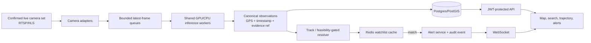

# Gujarat CCTV Intelligence Platform — Implementation Plan v5

**Purpose:** replace the current MVP delivery sequence with a plan that can
demonstrate the organiser-confirmed camera workflow credibly, while keeping the
statewide architecture as a separate production roadmap.

**Evidence used:** current repository state on 2026-09-11, the supplied
forensic audit, and the supplied functional/non-functional requirements.
Claims in the supplied requirements about organisers, people, prizes, or
government integrations are not treated as verified facts. This plan only
uses the engineering requirements.

## 1. Executive decision

Do not present the existing application as an 80,000-camera system. It is a
useful **30-camera prototype** with working detection, basic persistence,
search, WebSocket plumbing, and an interaction graph, but its end-to-end demo
path is blocked. The correct hackathon goal is:

> Demonstrate the organiser-confirmed number of registered **live** camera
> feeds, a seeded vehicle watchlist match, immediate alert, and a map
> trajectory using real saved coordinates.

The repository currently contains 30 camera records. Do not pad a live-feed
claim with replay clips. Replays are appropriate for deterministic testing or
an explicitly-labelled secondary demo only after the organiser accepts that
format in writing. Live operation must be described as *best effort* unless it
passes the acceptance tests in §7. Do not claim ANPR accuracy or external VAHAN/eGujCop
integration until validated adapters and written access approvals exist.

## 2. Current-state comparison

| Required capability | Current evidence | Status | Decision |
| --- | --- | --- | --- |
| Multi-feed RTSP/HLS ingestion | RTSP plus HLS fallback exists, but startup starts `min(cameras, 6)` workers. No ONVIF/vendor adapter boundary. | Partial | Make ingest adapters and bounded queues the first pipeline work. |
| Evaluation feed count | Registry has 30 local cameras; only 6 receive inference workers. The supplied brief says 50, but no authoritative organiser requirement was provided. | Unconfirmed / not met | Confirm the number and whether every feed must be live before extending the testbed. |
| GPU acceleration under 35 ms | Detector selects CUDA or CPU only; Apple MPS is not selected. | Not met | Add MPS selection and benchmark on the target machine. |
| Stable within-camera tracks | Greedy IoU tracker has no motion model. | Not met | Replace with ByteTrack/BoT-SORT or a Kalman + assignment tracker. |
| ANPR | Engine always returns `UNREADABLE`. | Not met | Build a plate crop → quality gate → OCR adapter path; preserve an explicit unreadable result. |
| Cross-camera entity resolution | Soft-biometric resolver exists, but matching must be protected by geographic adjacency and time/speed feasibility. | Partial / unsafe | Reject impossible transitions before merging and keep associations reviewable. |
| Watchlist alert | Matcher and WebSocket exist, but no seeded active entries prove the complete path. | Partial | Seed a synthetic demo watchlist and test alert delivery/acknowledgement. |
| GIS cameras and trajectory | Local source drops latitude/longitude; persisted camera model also has no latitude/longitude columns. Trajectory UI does not read route parameters or fetch data. | Not met | Add canonical coordinates, migrations, and a tested search-to-trajectory handoff. |
| Secure role-based API | UI writes an invalid `mock_token`; protected APIs reject it. Default credentials/secrets are in source configuration. | Not met / critical | Use a real demo login issuing signed JWTs; move secrets out of source and rotate exposed credentials. |
| Investigation graph | The real graph route is registered after an earlier stub with the same path. | Not met | Remove or rename the stub route, then add a route-level regression test. |
| Auditability | Audit model and read endpoint exist; actions are not consistently written as immutable audit events. | Partial | Add append-only audit middleware for search, view, alert/export, and connector calls. |
| Statewide scaling, edge-first delivery, HA | Redis service is deployed but no active message-bus pipeline, edge control plane, storage tiers, or failover. | Architecture only | Keep out of MVP claims; implement as the production programme in §8. |

## 3. Non-negotiable remediation order

### P0 — unblock the demo path

1. **Credential containment.** Revoke and rotate the camera-provider
   credential that was committed to project files/history. Remove credentials
   from JSON, frontend bundles, logs, and tracked `.env` files; use an ignored
   secret store or injected environment variables. Do not return RTSP URLs to
   browsers.
2. **Pin the demo database runtime.** Make `DATABASE_URL` an explicit
   Postgres/PostGIS connection in the one documented startup command used on
   demo day; fail startup if it is absent or points to SQLite. Verify the
   connection and spatial extension in the smoke test. The present application
   default is SQLite, even though Docker Compose defines a PostGIS service.
3. **Real demo authentication.** Add `POST /api/v1/auth/token` that validates
   seeded demo users and issues a short-lived JWT with `sub`, `role`, and
   jurisdiction claims. Change the frontend to call it; delete the mock-token
   fallback. The login, camera list, analytics, alerts, graph, and trajectory
   calls must succeed for their permitted roles.
4. **Unshadow core endpoints.** Remove the placeholder graph routes or move
   them below distinct prefixes. Keep one authoritative `GET /graph/{type}/{id}`.
5. **Restore spatial truth.** Add `latitude` and `longitude` to the Camera
   model and migration. Preserve them when loading local and remote catalogues;
   do not default unknown locations to Ahmedabad. A missing coordinate is a
   data-quality state, not a map point.
6. **Finish the UI handoff.** Read `entityType` and `entityId` from the route,
   call the canonical trajectory endpoint, and render loading, empty, and error
   states. Wire evidence export to a real asynchronous job or hide it until it
   exists.
7. **Deterministic demo data.** Seed the confirmed evaluation number of camera
   records, two synthetic
   watchlist targets, and a short replay route with observations. Never imply
   that synthetic data is live police data.
8. **Remove false evidence claims.** Disable the current evidence endpoint
   response that labels a placeholder hash and URL as a verified Section 65B
   package. Either generate a real package with a calculated SHA-256 manifest
   and provenance, or return an explicit `not implemented` status and hide the
   control in the UI.

### P1 — make detection and alerts credible

1. Introduce a `CameraAdapter` interface: `discover`, `health`,
   `open_stream`, and `metadata`. Ship RTSP/HLS first; document ONVIF/vendor
   adapters as separate implementations.
2. Use one shared detector/model per worker process, a bounded latest-frame
   queue per camera, and explicit dropped-frame/lag metrics. Do not create one
   pipeline/model per stream.
3. Prefer MPS on Apple Silicon, CUDA where available, then CPU. Benchmark
   actual p50/p95 inference and end-to-end alert latency before stating a
   performance number.
4. Replace greedy IoU tracking with a maintained tracker; retain track age,
   velocity, confidence, and reset/discontinuity signals.
5. Add plate detection, crop quality gating, OCR, Indian-plate normalisation,
   and confidence thresholds. Route low-quality results to `UNREADABLE`; do
   not fabricate plates. The demo watchlist path may use a clearly-labelled
   recorded target with a readable plate.
6. Use Redis for the active watchlist cache, invalidate on edits, and publish
   alert events through a single `alert.created` event interface. The MVP may
   use Redis Streams; Kafka is a production-scale replacement, not a cosmetic
   dependency.
7. Render backend-produced detection overlays (boxes, class, track ID,
   confidence, timestamp) over the feed. The overlay must have a clear
   `replay/live` indicator.

### P2 — preserve investigation integrity

1. **Vehicle association:** prevent false merges by applying camera-graph
   adjacency, elapsed time, route distance, maximum plausible speed,
   direction/FOV where known, and re-identification/plate evidence before a
   merge. Store evidence and reason codes; never merge on colour/class alone.
2. **Person association:** remove the current same-camera-only restriction.
   Permit cross-camera candidates only through the same adjacency/time/speed
   gates, then retain the evidence and confidence for human review. This fixes
   the current zero cross-camera-person-tracking path without creating the
   vehicle resolver's over-merge problem.
3. **Correlation API:** implement `POST /correlate` using the same feasible
   association constraints and return ranked, evidence-backed candidates; it
   must not return an unconditional empty list.
4. Require a human review state for identity-level matches and label all
   algorithmic associations as confidence estimates.
5. Make alert acknowledgement persist status, actor, timestamp, and comments.
6. Write append-only audit records for log-in, stream view, search, watchlist
   lookup, alert handling, trajectory view, and evidence export. Hash and
   timestamp evidence manifests; define retention and deletion rules.

## 4. Target MVP architecture

The synchronous hot path is frame → detection → normalised observation →
watchlist lookup → alert. Database writes, graph enrichment, evidence-package
generation, and analytics must be asynchronous so they cannot delay alerts.

## 5. Canonical contracts to implement first

### Camera

`camera_id, source, department, protocol, stream_ref, latitude, longitude,
district, jurisdiction_code, status, capability, privacy_policy_id`

### Observation

`observation_id, camera_id, edge_node_id, captured_at_utc, received_at_utc,
object_class, bbox, track_id, plate_text?, plate_confidence?, attributes,
latitude, longitude, evidence_ref, model_version, correlation_id`

### Alert

`alert_id, source_observation_id, watchlist_entry_id, match_type, confidence,
camera_id, latitude, longitude, created_at_utc, status, acknowledged_by?,
acknowledged_at?, audit_hash`

External systems (VAHAN, SARTHI, eGujCop/CCTNS, AFIS/NAFIS) must sit behind
versioned connector interfaces. For the hackathon, use mock adapters with
visible provenance (`source: demo-mock`); activate real connectors only with
authorisation, data agreements, rate limits, encryption, and audit controls.

## 6. Delivery slices

| Slice | Scope | Demonstrable outcome |
| --- | --- | --- |
| 1. Secure foundations | secret rotation, ignored config, demo JWT, RBAC tests | Role login unlocks authorised API calls; no secrets in client/source. |
| 2. Spatial demo | Confirmed-count camera seed, coordinate migration, camera map | All camera markers render at correct locations or show `location unavailable`. |
| 3. Alert path | replay fixture, watchlist cache, WebSocket, persistent acknowledgement | A scripted target causes one timely, actionable alert. |
| 4. Investigation path | search → trajectory API → map/timeline → graph | Judge can click one result and see a sourced chronological route. |
| 5. Perception quality | MPS/CUDA selection, bounded queues, tracker, OCR quality gate, overlays | Published benchmark and visible track/plate confidence indicators. |
| 6. Reliability | reconnect/health, backpressure, structured logs, smoke tests | A failed feed degrades visibly without taking down other cameras. |

## 7. Definition of done and acceptance tests

The MVP is demo-ready only when all are true:

1. A fresh checkout has no committed operational secrets and starts with a
   documented demo configuration that fails fast unless it connects to the
   intended Postgres/PostGIS database.
2. Operator, investigator, and command demo accounts receive valid JWTs; each
   can access only authorised endpoints and camera jurisdictions.
3. The camera API returns the organiser-confirmed number of live records with
   stable IDs and valid coordinates.
4. A replayed target produces an observation, a persistent watchlist alert,
   a WebSocket popup, and an auditable acknowledgement. Measure p95 alert
   latency from observation ingest; publish the measured result rather than an
   assumed sub-second claim.
5. Search result → trajectory shows ordered points, timestamps, camera labels,
   feasibility flags, and a clear empty state.
6. The graph endpoint returns the non-stub temporal graph for seeded data.
7. A 30-minute soak run reports worker health, frame age, queue drops,
   reconnects, model latency, and memory use, with no increasing frame age.
8. Automated tests cover JWT/RBAC, GPS retention, graph-route uniqueness,
   watchlist alert emission, trajectory handoff, and alert acknowledgement.
9. Frontend production build and backend test suite pass in the documented
   runtime environment.

## 8. Production programme — deliberately out of MVP scope

For 80,000 cameras, deploy district edge clusters that send metadata and
evidence references—not continuous raw video—to regional services. Use a
partitioned event backbone (Kafka or equivalent), regional GPU scheduling,
PostGIS with read replicas, object storage with hot/warm/cold lifecycle
policies, observability, disaster recovery exercises, mTLS, service identity,
and immutable/WORM audit retention. Establish lawful-purpose controls,
jurisdiction ABAC, human review, retention/deletion policy, data minimisation,
and independent security/privacy review before live public deployment.

This is a separate procurement, governance, and integration programme. It
must not be represented as complete merely because the MVP uses Docker, Redis,
or a local detection model.

## 9. Immediate next implementation ticket

Start with **Secure End-to-End Demo Path**: credential rotation/config cleanup,
real demo JWT login, remove graph route shadowing, persist GPS, seed the
confirmed live camera set and watchlist entries, then add a single
end-to-end test proving alert → WebSocket → acknowledgement → trajectory.
